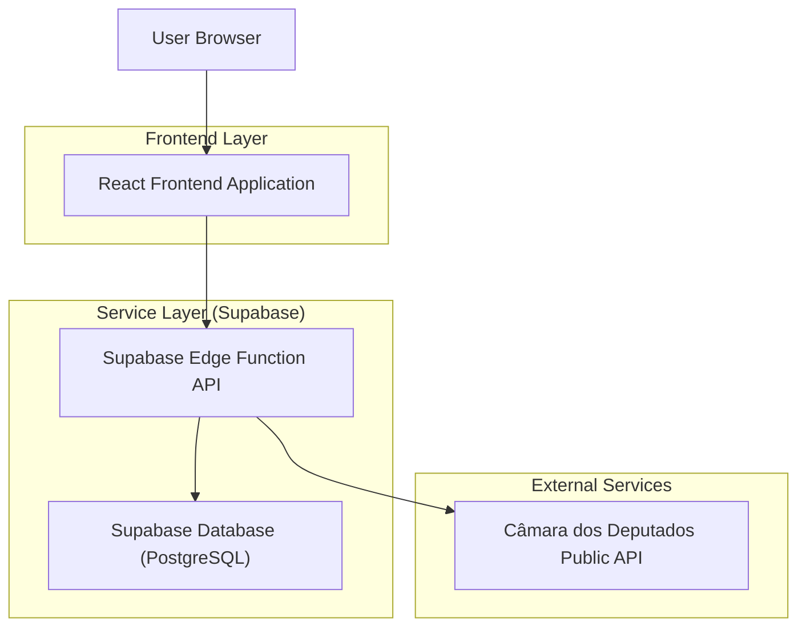
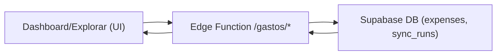
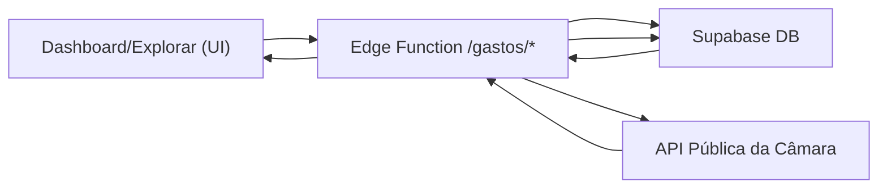
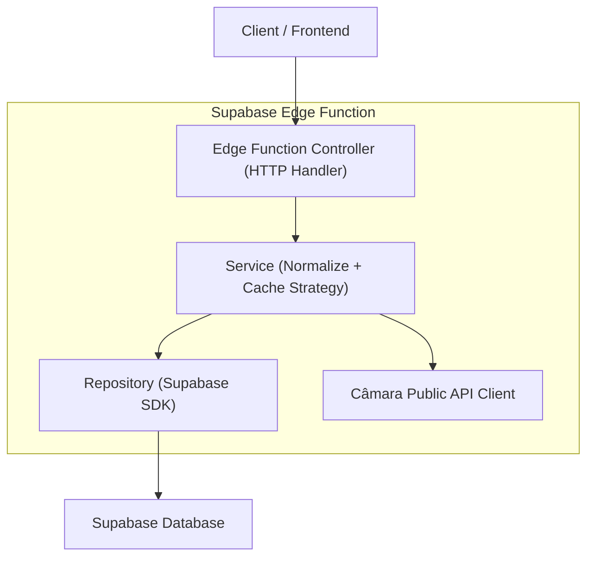
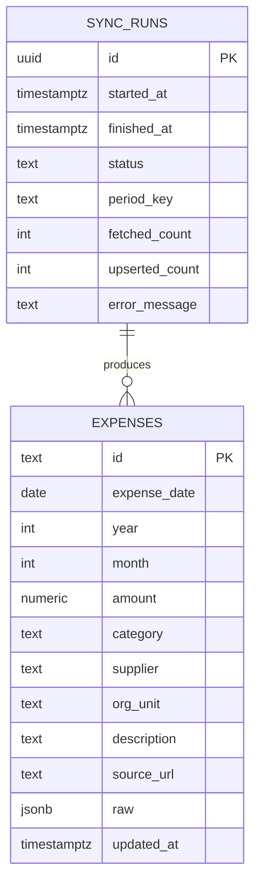

## 1.Architecture design


### Fluxos de dados (API → BD → Dashboard)
**Leitura típica (dashboard e exploração)**


**Cache miss / dado desatualizado (refresh sob demanda)**


Notas:
- O **dashboard** ("Início") e a página **Explorar** consultam **principalmente o BD** para performance e consistência.
- A Edge Function decide a estratégia de cache (ex.: por `year/month`), atualiza o BD via upsert e devolve o recorte já normalizado.

## 2.Technology Description
- Frontend: React@18 + TypeScript + vite + tailwindcss@3 + charting (ex.: echarts ou recharts)
- Backend: Supabase Edge Functions (HTTP) + Supabase Auth (opcional, não obrigatório para leitura pública)
- Database: Supabase (PostgreSQL) + JSONB para payload bruto (quando necessário)

## 3.Route definitions
| Route | Purpose |
|-------|---------|
| / | Início com visão geral e atalhos de exploração |
| /explorar | Explorar gastos com filtros, tabela e gráficos |
| /despesa/:id | Detalhe de uma despesa específica |

## 4.API definitions (If it includes backend services)
### 4.1 Core API
Observação: as Edge Functions funcionam como “fachada” para a API pública e como camada de cache/consulta.

```
GET /functions/v1/gastos/resumo?ano=YYYY&mes=MM
GET /functions/v1/gastos/consultar?ano=YYYY&mes=MM&categoria=&fornecedor=&texto=&minValor=&maxValor=&page=&pageSize=&sort=
GET /functions/v1/gastos/detalhe?id=...
GET /functions/v1/gastos/exportar.csv?<mesmos_parametros>
```

Tipos (compartilhados entre front e function):
```ts
type MoneyBRL = number;

type GastosFiltro = {
  ano: number;
  mes?: number;
  categoria?: string;
  fornecedor?: string;
  texto?: string;
  minValor?: number;
  maxValor?: number;
  page?: number;
  pageSize?: number;
  sort?: string; // ex.: "valor.desc" | "data.asc"
};

type GastoItem = {
  id: string;
  data: string; // ISO
  valor: MoneyBRL;
  descricao?: string;
  categoria?: string;
  fornecedor?: string;
  orgao?: string;
  sourceUrl?: string;
};
```

## 5.Server architecture diagram (If it includes backend services)


## 6.Data model(if applicable)
### 6.1 Data model definition


### Decisões finais de modelagem
- **Modelo “flat” para leitura rápida**: `expenses` mantém `category/supplier/org_unit` como **TEXT** (sem tabelas normalizadas) para reduzir joins no dashboard.
- **Chave primária**: `expenses.id` é **TEXT** (id da fonte) e é usada como chave de deduplicação no upsert.
- **Particionamento lógico por período**: `year` e `month` obrigatórios + índice composto `(year, month)` para filtrar rápido.
- **Auditabilidade**: `sync_runs` registra execução por `period_key` (ex.: `2026-03`), contagens e erro para exibir “Última atualização”.
- **Preservação de fonte**: `raw JSONB` guarda payload original quando necessário para debugging e futuros campos.
- **Sem FKs físicas**: relacionamento `sync_runs -> expenses` é lógico (aplicação), evitando rigidez na ingestão inicial.

### 6.2 Data Definition Language
SYNC_RUNS
```
CREATE TABLE sync_runs (
  id UUID PRIMARY KEY DEFAULT gen_random_uuid(),
  started_at TIMESTAMPTZ NOT NULL DEFAULT NOW(),
  finished_at TIMESTAMPTZ,
  status TEXT NOT NULL,
  period_key TEXT NOT NULL,
  fetched_count INTEGER DEFAULT 0,
  upserted_count INTEGER DEFAULT 0,
  error_message TEXT
);

CREATE TABLE expenses (
  id TEXT PRIMARY KEY,
  expense_date DATE,
  year INTEGER NOT NULL,
  month INTEGER NOT NULL,
  amount NUMERIC(14,2) NOT NULL,
  category TEXT,
  supplier TEXT,
  org_unit TEXT,
  description TEXT,
  source_url TEXT,
  raw JSONB,
  updated_at TIMESTAMPTZ NOT NULL DEFAULT NOW()
);

CREATE INDEX idx_expenses_year_month ON expenses(year, month);
CREATE INDEX idx_expenses_supplier ON expenses(supplier);
CREATE INDEX idx_expenses_category ON expenses(category);

-- RLS (políticas mínimas para leitura pública)
ALTER TABLE expenses ENABLE ROW LEVEL SECURITY;
ALTER TABLE sync_runs ENABLE ROW LEVEL SECURITY;

CREATE POLICY "anon_read_expenses" ON expenses
  FOR SELECT TO anon
  USING (true);

CREATE POLICY "anon_read_sync_runs" ON sync_runs
  FOR SELECT TO anon
  USING (true);

-- Permissões (leitura pública e escrita restrita)
GRANT SELECT ON expenses TO anon;
GRANT ALL PRIVILEGES ON expenses TO authenticated;
GRANT SELECT ON sync_runs TO anon;
GRANT ALL PRIVILEGES ON sync_runs TO authenticated;
```