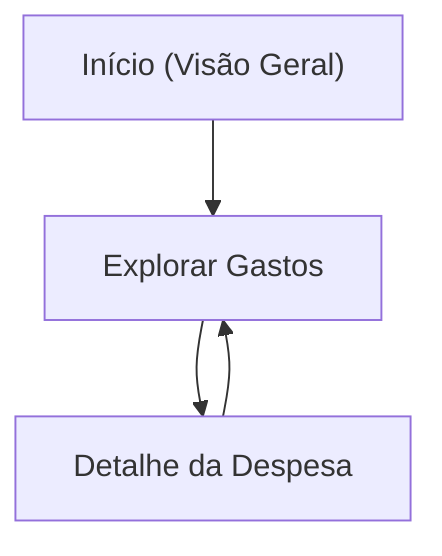

## 1. Product Overview
Portal web para explorar e entender os gastos da Câmara dos Deputados.
Integra a API pública da Câmara e usa o Supabase (já conectado) como base de dados/cache para consultas rápidas e consistentes.

## 2. Core Features

### 2.1 Feature Module
1. **Início (Visão Geral)**: KPIs principais, séries temporais, atalhos para filtros e exploração.
2. **Explorar Gastos**: filtros avançados, tabela paginada, gráficos comparativos, exportação de resultados.
3. **Detalhe da Despesa**: visão completa do registro, histórico/atributos, links para fonte oficial e itens relacionados.

### 2.3 Page Details
| Page Name | Module Name | Feature description |
|-----------|-------------|---------------------|
| Início (Visão Geral) | Cabeçalho e navegação | Exibir nome do portal, links para “Início” e “Explorar”, e estado do último sync/carga. |
| Início (Visão Geral) | Filtros rápidos | Selecionar ano/mês e um recorte principal (ex.: categoria) e aplicar para abrir “Explorar” já filtrado. |
| Início (Visão Geral) | KPIs e tendências | Mostrar total gasto no período, variação vs. período anterior e top categorias/fornecedores. |
| Início (Visão Geral) | Visualizações-resumo | Exibir série temporal (linha/coluna) e distribuição (barras) com interação de hover e clique para filtrar. |
| Explorar Gastos | Filtros avançados | Filtrar por período (ano/mês), categoria, órgão/unidade, fornecedor, texto livre (descrição), faixa de valor e ordenação. |
| Explorar Gastos | Resultados (tabela) | Listar despesas com paginação, ordenação por colunas, formatação monetária e ação “ver detalhe”. |
| Explorar Gastos | Gráficos comparativos | Alternar entre visões (por mês, por categoria, por fornecedor) baseadas no conjunto filtrado. |
| Explorar Gastos | Exportação | Exportar resultados filtrados (CSV) e copiar link compartilhável com parâmetros de filtro. |
| Detalhe da Despesa | Cabeçalho do registro | Exibir identificação do item, valor, data e breadcrumb de volta para “Explorar” preservando filtros. |
| Detalhe da Despesa | Atributos e fonte | Mostrar campos completos disponíveis, e link direto para o recurso/registro na fonte oficial (API/portal). |
| Detalhe da Despesa | Relacionados | Listar despesas do mesmo fornecedor/categoria/período e permitir navegar para outro detalhe. |

## 3. Core Process
Fluxo principal (visitante): você entra no “Início” (dashboard), escolhe um período e/ou recorte rápido, vai para “Explorar” com os filtros aplicados, refina a busca, analisa tabela e gráficos, e abre um item em “Detalhe da Despesa”. Se quiser, exporta o recorte em CSV ou compartilha o link.

Fluxo de dados (alto nível): as páginas consultam a camada API (Edge Function) que lê do Supabase (BD/cache) para montar KPIs, gráficos e tabelas; quando um período ainda não estiver persistido ou estiver desatualizado, a camada API busca na API pública da Câmara, normaliza e grava no BD antes de responder. O “Último sync/carga” visível no header vem de registros de execução (`sync_runs`).

